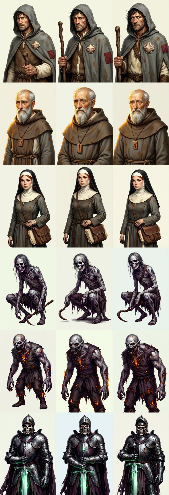
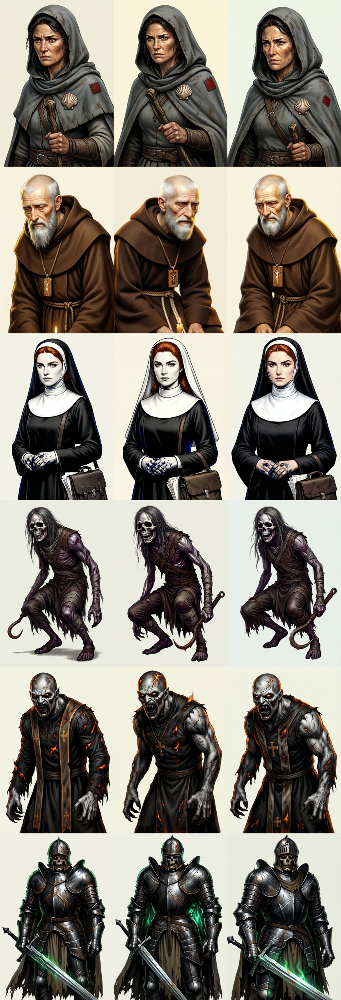

# Slice B2 — the starter-fantasy cast sheet (cloud run, 2026-09-02)

> **ON HOLD — Director ruling 2026-09-02:** the cast-sheet approach was set
> aside — portraits must be made as needed so every character is unique, not
> drawn from a fixed roster. These sheets stay as the record of two rulings
> (the pilgrim's sex; descriptions via prompt-craft contracts).

**Proof 6 of `docs/living-world-slice-b2.md`:** the starter-fantasy cast rendered
through the pinned workflow for the Director's ruling. Cloud backend (Comfy
Cloud via the hosted MCP plugin); the local-backend parity sheet follows when
the local ComfyUI can have the GPU.

## Second sheet — descriptions from prompt-craft contracts (current)

The Director's ruling on the first sheet: the pilgrim had rendered as a nun
and is **male**, and descriptions must come from **prompt-craft** contracts so
that a description makes a proper character. The cast was re-authored as
contracts (`dogfood/portraits/contracts/{factions,characters}`, validated by
`pcraft`), the prompts derived from their atoms, and the cast re-rendered.

Rows: Suspicious Pilgrim · Brother Aldric · Sister Maren · Crypt Stalker · Ash
Ghoul · Crypt Warden. Columns: seed, seed+1, seed+2.

Coordinator reading, before the gate:

- **Pilgrim:** a middle-aged man — hood half back, stubble, scallop badge, red
  patch, staff. Every atom present; the correction landed.
- **Aldric, Maren, Stalker, Warden:** on contract. Maren's veil rendered black
  over a white coif where the atom says "plain white veil" — the gate's veil
  question will decide, and the contract may need the word "wimple-less" made
  explicit as a must_not.
- **Ash Ghoul:** the first contract render read "the charred remnants of a
  plain sexton's work tunic" as a modern work shirt and overalls — a
  contract-authoring lesson, not a model failure ("work tunic" is one paraphrase
  from "work clothes"). The atom was rewritten as a period garment ("a burnt,
  threadbare medieval tunic and hose, charred at the hems"), a required
  must_not for modern clothes added, and the ghoul re-rendered: the row above
  is that second render, on contract.

## First sheet — hand-written slot descriptions (superseded)

Kept for the record of the ruling: the pilgrim in row one is the nun the
Director rejected. Its prompts were the coordinator's prose, not contracts.

## How it was made

| Item | Value |
|---|---|
| Tool | `portrait-forge` (private, `mcp-tool-shop-org/portrait-forge`): `scripts/from-contracts.mjs` → `scripts/emit-graphs.mjs` |
| Contracts | `dogfood/portraits/contracts/` — `faction:chapel-folk`, `faction:crypt-undead`, six `char:*` (each `pcraft validate` clean; `pcraft synth` is the provenance witness) |
| Workflow | `workflows/qwen-sfhd.portrait.json`, SHA-256 `0f586da32e7e…` (full hash in the index file beside each sheet) |
| Base | `qwen_image_2512_fp8_e4m3fn.safetensors` |
| LoRA | `sfhd_style_v1_000001250` at 0.85 (on Comfy Cloud as `SaintEloi__sfhd-style-v1-lora__sfhd_style_v1_1250.safetensors`) |
| Sampler | euler / simple, 50 steps, cfg 4.0, shift 3.1, 832×1216 |
| Prompt | `sfhd style, [every expected-yes atom, contract order], [shot]`; negative = every expected-no atom + the frozen technical negatives |
| Seeds | low 53 bits of SHA-256(packId, entityId, descriptionHash); the description hash is the contract's atoms |
| Backend | Comfy Cloud, one `submit_batch` of 18; all completed, none failed |

## Next

1. Gate each entity (`scripts/gate-cast.sh casts/starter-fantasy _cloud/starter-fantasy-v2/out`): one question per contract atom through SigLIP2 and `qwen3.6:27b`; registry manifests record every answer.
2. Rewrite the ghoul's garment atom; re-render the ghoul only.
3. Local-backend parity sheet; then the Director rules on the sheet; wave 11 wires the adapters.
